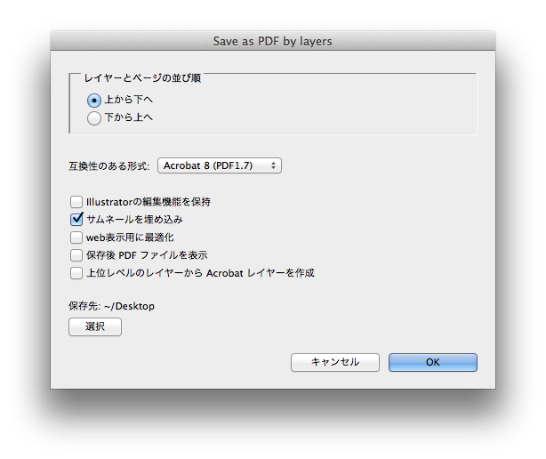

***Adobe Illustrator Scripts***

---

**Script 1**

# レイヤー毎にPDFとして保存

## 特徴

- ページをレイヤー分けしておくと、自動でPDFに書き出してくれます
- 不要なレイヤーは毎回削除するので、無駄にデータが増えません
- レイヤーの並び順に従い、ファイル名の頭に番号がつきます（後は、Acrobatで連結してください）

## 機能

- 最上位階層のレイヤーを上（または下）から順にPDFで保存します
- ロックされているレイヤーは操作の対象になりません
- ヘッダーなどの共通部分を含むレイヤーは「表示」＆「ロック」しておくと便利です
- 下位階層のレイヤーは操作の対象になりません。また、最上位階層でも「非表示」＆「ロック」状態のレイヤーも非表示のまま書き出し対象になりますので、不必要なレイヤーはあらかじめ破棄しておくことをお勧めします（同梱の「[非表示アイテムを全消去](#-4)」を活用してください）
- 書き出されたPDFのファイル名の接頭数字は３桁でつくので、Acrobatで一気に読みこんだ時に順番の入替作業が不要で便利です

## インストール

ダウンロードした`レイヤー毎にPDFとして保存.jsx`を`/Applications/Adobe Illustrator/preset/script/`以下に移動。その後、Illustratorを起動します。

## 使い方

1. Illustratorを起動
2. PDFとして書き出したいAIファイルを開く
3. `ファイル`＞`スクリプト`から、`レイヤー毎にPDFとして保存`を選択
4. ダイアログから並び順や保存先、各オプションを設定して`OK`

---

**Script 2**

# 非表示アイテムを全消去

## 特徴

非表示状態のレイヤーやアイテム・グループをきれいに消去します。
ロックされてても関係なく消されます。

## 機能

1. 非表示状態のアイテムの消去
2. 非表示状態のレイヤーの消去
3. 子要素がなくなったレイヤーの消去（クリーンナップ）

## インストール

ダウンロードした`非表示アイテムを全消去.jsx`を`/Applications/Adobe Illustrator/preset/script/`以下に移動。その後、Illustratorを起動します。

## 使い方

1. Illustratorを起動
2. AIファイルを開く
3. `ファイル`＞`スクリプト`から、`非表示アイテムを全消去`を選択
4. 消去結果がポップアップで表示されます
